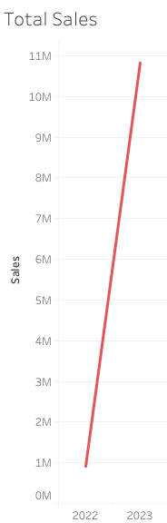
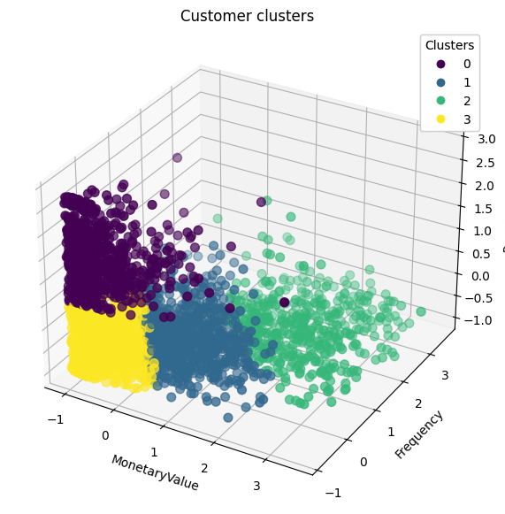
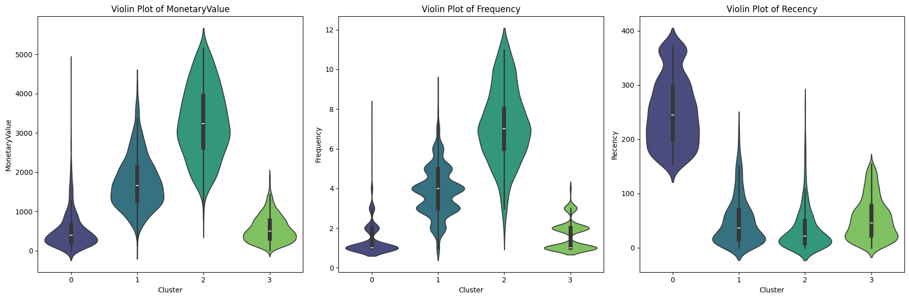
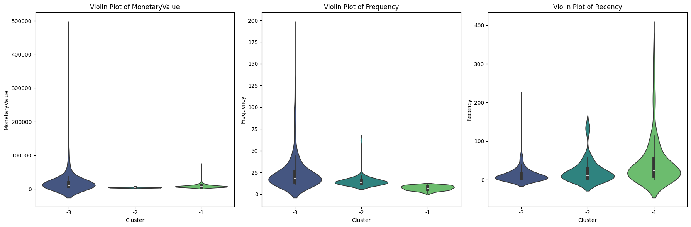

# Customer Segmentation for Targeted Marketing

## Background and Overview

This analysis utilizes historical transaction data to segment GreenField Stores' customer base. By identifying distinct customer profiles and purchasing behaviors, the segmentation aims to optimize targeted marketing strategies. This data-driven approach empowers the business to enhance customer engagement, improve retention metrics, and drive revenue growth through more personalized and effective marketing campaigns.

## Executive Summary

In 2023, GreenField achieved remarkable growth, with total revenue reaching 10,827,301 million. This represents a significant increase of approximately 1089.55% compared to the 910,199 million revenue generated in 2022. The substantial growth highlights GreenField's exceptional performance, reflecting successful strategic initiatives, market expansion, and enhanced operational efficiencies.

## Methodology

### Data Cleaning & Preprocessing
- **Removed:**
  - Transactions with missing customer IDs.
  - Cancelled orders (negative quantities).
  - Transactions with zero or negative unit prices.
- **Derived New Features:**
  - **Total Revenue** = Quantity × Unit Price.
  - **Invoice Month** = Extracted from invoice dates for time-series analysis.

### Exploratory Data Analysis (EDA)
- Identified top-selling products by revenue and quantity.
- Analyzed sales distribution across countries.
- Observed seasonal trends and monthly revenue changes.

### Feature Engineering
- Created **Recency, Frequency, and Monetary Value (RFM)** scores:
  - **Recency:** Days since the last purchase.
  - **Frequency:** Total number of transactions.
  - **Monetary:** Total revenue contributed by a customer.
- Standardized RFM scores for clustering.

### Customer Segmentation
- Applied **K-Means Clustering** to group customers into segments based on RFM scores.
- Used **Elbow Method** to determine the optimal number of clusters.
- Validated clusters using **Silhouette Scores**.

## Clustering Results

### 0. **High-Value Customers**  
- **Characteristics**: Low recency, high frequency, high monetary value.  
- **Insights**: These customers are the most loyal and valuable, contributing significantly to revenue.  
- **Recommendations**:  
  - Implement exclusive loyalty programs and personalized offers to retain these customers.
  - Provide VIP benefits such as early access to new products, special discounts, or free shipping to strengthen loyalty.

---

### 1. **Medium-Value Customers**  
- **Characteristics**: Moderate recency, frequency, and monetary value.  
- **Insights**: These customers have the potential to become high-value customers with increased engagement.  
- **Recommendations**:  
  - Focus on increasing frequency with targeted promotions and personalized product recommendations.
  - Introduce loyalty incentives like points for purchases or exclusive offers to convert them into more valuable customers.

---

### 2. **Low-Value Customers**  
- **Characteristics**: High recency, low frequency, low monetary value.  
- **Insights**: These customers have recently engaged with the brand but are not yet making frequent or high-value purchases.  
- **Recommendations**:  
  - Offer re-engagement campaigns with personalized offers or discounts.
  - Use targeted advertising or email campaigns to bring them back and increase transaction frequency.

---

### 3. **One-Time Buyers**  
- **Characteristics**: Single transaction, low recency, and monetary value.  
- **Insights**: A significant group that has the potential for growth if engaged correctly.  
- **Recommendations**:  
  - Target these customers with first-purchase rewards, follow-up recommendations, and re-engagement campaigns to convert them into repeat buyers.
  - Provide incentives like discounts on future purchases or free shipping to encourage return visits.

---

### Key Takeaways:
- **High-Value Customers** should be nurtured through personalized loyalty programs and VIP benefits.
- **Medium-Value Customers** should be encouraged to increase their frequency of purchases with targeted offers and loyalty rewards.
- **Low-Value Customers** require re-engagement campaigns to boost their transaction frequency and monetary value.
- **One-Time Buyers** should be converted into repeat customers through incentives and follow-up promotions.

By focusing on these strategies, GreenField Stores can optimize marketing efforts, improve customer retention, and drive long-term growth.

## Outlier Clusters
 
Based on customer behavior data, three outlier customer clusters have been identified that represent distinct groups with unique behaviors. These clusters help inform targeted marketing strategies for better customer engagement and revenue growth.

---

 **Premium Loyal Customers (Cluster -3)**

- **Characteristics**: High monetary value, frequent purchases, but lower recency.
- **Business Insights**: These customers are long-term, high-value clients. However, their recent inactivity suggests a risk of churn.
- **Recommendations**:  
  - Re-engagement campaigns with personalized offers or loyalty rewards.
  - VIP programs with exclusive access or discounts to maintain their loyalty.

---

 **High-Value Lapsed Customers (Cluster -1)**

- **Characteristics**: Average monetary value, lower frequency, but very high recency.
- **Business Insights**: These customers have recently made purchases but don't engage frequently. They have potential for increased spending.
- **Recommendations**:  
  - Cross-sell and upsell based on recent purchases.
  - Introduce strategies to boost purchase frequency, such as time-sensitive discounts or subscription models.

---

 **Mid-Value Occasional Customers (Cluster -2)**

- **Characteristics**: Lower monetary value, average frequency, and recency.
- **Business Insights**: These customers make occasional purchases but contribute less revenue.
- **Recommendations**:  
  - Increase engagement with targeted offers to drive more frequent purchases.
  - Introduce product bundles or loyalty programs to boost spending.

---

#### Key Takeaways:
- **Premium Loyal Customers** should be nurtured with exclusive offers and re-engagement campaigns.
- **High-Value Lapsed Customers** should be targeted with campaigns to increase purchase frequency and spending.
- **Mid-Value Occasional Customers** can be converted into more frequent buyers with personalized incentives and product promotions.

By focusing on these strategies, GreenField Stores can optimize marketing efforts, improve customer retention, and drive long-term growth.

## Insights and Recommendations

### Insights
- **High-Value Customers** are the most loyal, contributing significantly to revenue.
- **Medium-Value Customers** have the potential to move up to high-value segments with targeted strategies.
- **Low-Value Customers** need personalized campaigns to boost their engagement.
- **One-Time Buyers** represent an opportunity for growth, especially with the right incentives.

### Recommendations
1. **Loyalty Programs:**
   - Reward **High-Value Customers** with exclusive discounts and offers.
   - Provide incentives for **Medium-Value Customers** to increase their frequency of purchases.

2. **Re-Engagement Campaigns:**
   - Offer personalized discounts to **Low-Value Customers** to increase their purchase frequency.
   - Target **One-Time Buyers** with first-purchase rewards and personalized product recommendations.

3. **Product Management:**
   - Focus on stocking and promoting top-selling products during peak seasons.
   - Expand product offerings based on international preferences and trends.
